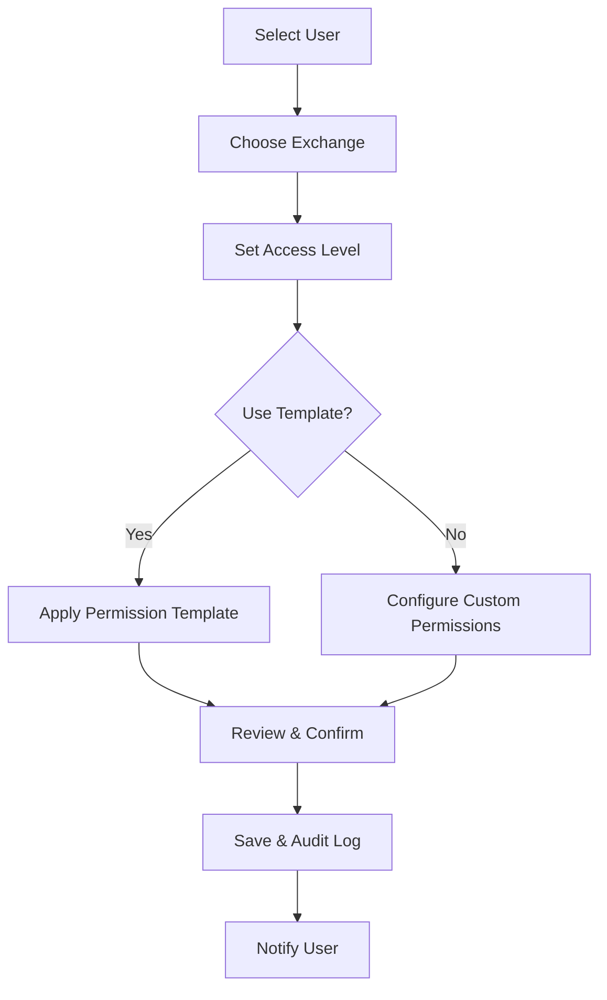

# 🔐 Peak 1031 Exchange Platform - Permission & Security Guide

## Table of Contents
1. [Overview](#overview)
2. [Permission System Architecture](#permission-system-architecture)
3. [User Roles & Access Levels](#user-roles--access-levels)
4. [Exchange-Specific Permissions](#exchange-specific-permissions)
5. [Admin Security Controls](#admin-security-controls)
6. [Best Practices](#best-practices)
7. [Security Hardening](#security-hardening)
8. [Audit & Monitoring](#audit--monitoring)
9. [Troubleshooting](#troubleshooting)
10. [Emergency Procedures](#emergency-procedures)

---

## Overview

The Peak 1031 Exchange Platform implements a sophisticated **exchange-centric permission system** that provides granular access control for each 1031 exchange. This system ensures that users only see and interact with data they are explicitly authorized to access.

### Key Security Principles
- **Principle of Least Privilege**: Users receive only the minimum permissions needed
- **Exchange Isolation**: Permissions are scoped per exchange, preventing cross-exchange access
- **Role-Based Access Control (RBAC)**: Permissions are grouped by logical roles
- **Audit Trail**: All permission changes and access attempts are logged
- **Defense in Depth**: Multiple layers of security controls

---

## Permission System Architecture

### 🏗️ **Three-Layer Security Model**

```
┌─────────────────────────────────────────────────────────────┐
│                    APPLICATION LAYER                        │
│  ┌─────────────────┐ ┌─────────────────┐ ┌─────────────────┐ │
│  │   Frontend UI   │ │  API Routes     │ │  Socket.IO      │ │
│  │  Permission     │ │  Middleware     │ │  Auth           │ │
│  │  Aware          │ │  Protection     │ │  Middleware     │ │
│  └─────────────────┘ └─────────────────┘ └─────────────────┘ │
└─────────────────────────────────────────────────────────────┘
┌─────────────────────────────────────────────────────────────┐
│                   PERMISSION LAYER                          │
│  ┌─────────────────┐ ┌─────────────────┐ ┌─────────────────┐ │
│  │ Permission      │ │ Role Templates  │ │ Access Control  │ │
│  │ Service         │ │ & Inheritance   │ │ Lists (ACLs)    │ │
│  └─────────────────┘ └─────────────────┘ └─────────────────┘ │
└─────────────────────────────────────────────────────────────┘
┌─────────────────────────────────────────────────────────────┐
│                    DATABASE LAYER                           │
│  ┌─────────────────┐ ┌─────────────────┐ ┌─────────────────┐ │
│  │ Row Level       │ │ Permission      │ │ Audit Logs      │ │
│  │ Security (RLS)  │ │ Tables          │ │ & Monitoring    │ │
│  └─────────────────┘ └─────────────────┘ └─────────────────┘ │
└─────────────────────────────────────────────────────────────┘
```

### 🔧 **Core Components**

#### 1. Permission Types (20+ Granular Permissions)
```typescript
enum PermissionType {
  // Overview & Exchange Access
  'view_overview',
  
  // Messaging Permissions
  'view_messages',
  'send_messages',
  
  // Task Management
  'view_tasks',
  'create_tasks',
  'edit_tasks',
  'assign_tasks',
  
  // Document Management
  'view_documents',
  'upload_documents',
  'edit_documents',
  'delete_documents',
  
  // Participant Management
  'view_participants',
  'manage_participants',
  
  // Financial Access
  'view_financial',
  'edit_financial',
  
  // Timeline & Reports
  'view_timeline',
  'edit_timeline',
  'view_reports',
  
  // Administrative
  'admin_exchange'
}
```

#### 2. Database Schema
```sql
-- Core permission tracking
CREATE TABLE user_exchange_permissions (
    id UUID PRIMARY KEY DEFAULT gen_random_uuid(),
    user_id UUID REFERENCES users(id),
    exchange_id UUID REFERENCES exchanges(id),
    permission_type permission_type_enum NOT NULL,
    granted_by UUID REFERENCES users(id),
    granted_at TIMESTAMP DEFAULT NOW(),
    expires_at TIMESTAMP,
    is_active BOOLEAN DEFAULT TRUE
);

-- Access level templates
CREATE TABLE permission_templates (
    id UUID PRIMARY KEY DEFAULT gen_random_uuid(),
    name VARCHAR(100) NOT NULL,
    description TEXT,
    role_type VARCHAR(50),
    permissions TEXT[] NOT NULL,
    is_default BOOLEAN DEFAULT FALSE,
    organization_id UUID
);

-- Exchange access levels
CREATE TABLE user_exchange_access (
    id UUID PRIMARY KEY DEFAULT gen_random_uuid(),
    user_id UUID REFERENCES users(id),
    exchange_id UUID REFERENCES exchanges(id),
    access_level access_level_enum NOT NULL,
    assigned_by UUID REFERENCES users(id),
    assigned_at TIMESTAMP DEFAULT NOW(),
    notes TEXT
);
```

---

## User Roles & Access Levels

### 🎭 **System-Wide Roles**

#### **Admin**
- **Global Access**: Can access all exchanges and system settings
- **User Management**: Create, modify, and delete users
- **Permission Management**: Grant/revoke any permission
- **System Configuration**: Modify system-wide settings
- **Audit Access**: View all audit logs and security events

#### **Coordinator** 
- **Multi-Exchange Management**: Can be assigned to multiple exchanges
- **Team Leadership**: Manage users within assigned exchanges
- **Workflow Control**: Create and assign tasks across exchanges
- **Client Communication**: Full messaging and document access

#### **Client**
- **Exchange-Specific Access**: Only assigned exchanges
- **Self-Service Portal**: View progress, documents, communications
- **Limited Interaction**: Cannot create users or modify system settings
- **Secure Communication**: Encrypted messaging with team

#### **Third Party** (Attorneys, CPAs, QIs)
- **Professional Access**: Read-only or limited write access
- **Document Review**: Access to relevant legal/financial documents
- **Consultation Mode**: Participate in communications when needed
- **Compliance Reporting**: Generate reports within scope

#### **Agency**
- **Multi-Client Overview**: Dashboard spanning multiple clients
- **Referral Tracking**: Monitor referred client progress
- **Commission Reporting**: Access to relevant financial data
- **Limited Administrative**: Cannot modify core exchange data

### 🔐 **Exchange Access Levels**

#### **None**
- No access to the exchange
- User cannot see the exchange in their dashboard
- All API calls return 403 Forbidden

#### **Read**
- View-only access to assigned features
- Cannot create, edit, or delete content
- Perfect for observers, auditors, or limited third parties

#### **Write** 
- Can view and modify content within permissions
- Create documents, tasks, and messages
- Cannot manage other users or exchange settings

#### **Admin**
- Full control over the exchange
- Manage participant permissions
- Configure exchange settings
- Access to all features and data

---

## Exchange-Specific Permissions

### 🎯 **Permission Categories**

#### **Overview & Navigation**
```typescript
{
  permission: 'view_overview',
  description: 'Access to exchange summary, deadlines, and key metrics',
  includes: [
    'Exchange dashboard',
    'Timeline view',
    'Deadline tracking',
    'Status indicators',
    'Quick actions menu'
  ]
}
```

#### **Communication**
```typescript
{
  permissions: ['view_messages', 'send_messages'],
  description: 'Exchange messaging and communication features',
  granular_control: {
    view_messages: 'Read chat history, file attachments',
    send_messages: 'Post messages, upload files, @mention users'
  },
  security_notes: [
    'Messages are encrypted in transit and at rest',
    'File attachments respect document permissions',
    'Real-time delivery requires WebSocket authentication'
  ]
}
```

#### **Task Management**
```typescript
{
  permissions: ['view_tasks', 'create_tasks', 'edit_tasks', 'assign_tasks'],
  description: 'Project management and workflow control',
  permission_matrix: {
    view_tasks: 'See task lists, details, and progress',
    create_tasks: 'Add new tasks to the exchange',
    edit_tasks: 'Modify task details, status, and priority',
    assign_tasks: 'Assign tasks to other exchange participants'
  },
  inheritance_rules: [
    'edit_tasks includes view_tasks',
    'assign_tasks requires create_tasks',
    'Task creators can always edit their own tasks'
  ]
}
```

#### **Document Management**
```typescript
{
  permissions: ['view_documents', 'upload_documents', 'edit_documents', 'delete_documents'],
  description: 'File storage and document lifecycle management',
  security_features: {
    encryption: 'AES-256 encryption for sensitive documents',
    access_control: 'PIN protection for confidential files',
    audit_trail: 'Complete download and modification history',
    version_control: 'Document versioning and rollback capability'
  }
}
```

### 🔒 **Permission Templates**

Pre-configured permission sets for common roles:

#### **Client Full Access**
```json
{
  "name": "Client Full Access",
  "permissions": [
    "view_overview",
    "view_messages", "send_messages",
    "view_tasks",
    "view_documents", "upload_documents",
    "view_timeline",
    "view_reports"
  ],
  "description": "Complete access for primary exchange client"
}
```

#### **Third Party Limited**
```json
{
  "name": "Third Party Professional",
  "permissions": [
    "view_overview",
    "view_messages",
    "view_documents",
    "view_reports"
  ],
  "description": "Read-only access for attorneys, CPAs, and consultants"
}
```

#### **Coordinator Standard**
```json
{
  "name": "Exchange Coordinator",
  "permissions": [
    "view_overview",
    "view_messages", "send_messages",
    "view_tasks", "create_tasks", "edit_tasks", "assign_tasks",
    "view_documents", "upload_documents", "edit_documents",
    "view_participants", "manage_participants",
    "view_timeline", "edit_timeline",
    "view_reports"
  ],
  "description": "Full operational control for exchange coordination"
}
```

---

## Admin Security Controls

### 🛡️ **User Management Dashboard**

#### **Accessing User Management**
1. Navigate to **Admin → User Management**
2. Authenticate with admin credentials
3. Select exchange or system-wide view

#### **Creating Secure User Accounts**

```bash
# Secure User Creation Checklist
□ Strong password requirements enforced
□ Multi-factor authentication configured
□ Appropriate role assigned
□ Exchange access carefully scoped
□ Permission template applied
□ Account expiration date set (if temporary)
□ Audit notification enabled
```

#### **Permission Assignment Workflow**



### 🔧 **Exchange Permission Management**

#### **Managing Exchange Access**

1. **Navigate to Exchange**
   ```
   Dashboard → Exchanges → [Select Exchange] → Manage Users
   ```

2. **Add New User to Exchange**
   ```typescript
   // Click "Add User" button
   // Select from existing users or invite new user
   // Choose access level: None | Read | Write | Admin
   // Apply permission template or customize
   // Add notes for future reference
   // Save changes
   ```

3. **Modify Existing Permissions**
   ```typescript
   // Click gear icon next to user
   // Adjust individual permissions
   // Or change access level template
   // Document reason for change
   // Apply immediately or schedule
   ```

4. **Bulk Permission Updates**
   ```typescript
   // Select multiple users
   // Choose bulk action
   // Apply new template or specific permissions
   // Confirm changes affect selected users only
   ```

### 📋 **Permission Audit Interface**

#### **Real-Time Permission Monitoring**
```typescript
// Admin Dashboard - Permission Overview
interface PermissionDashboard {
  activeUsers: number;
  exchangeAccess: {
    exchange_id: string;
    user_count: number;
    permission_distribution: {
      admin: number;
      write: number;
      read: number;
    }
  }[];
  recentChanges: PermissionChange[];
  securityAlerts: SecurityAlert[];
}
```

#### **Permission Change History**
Every permission change is logged with:
- **Who**: User who made the change
- **What**: Specific permissions modified
- **When**: Timestamp with timezone
- **Where**: Exchange or system-wide
- **Why**: Notes or reason provided
- **Impact**: Number of users affected

---

## Best Practices

### 🎯 **Permission Strategy**

#### **1. Principle of Least Privilege**
```typescript
// ✅ GOOD: Minimal necessary permissions
const clientPermissions = [
  'view_overview',
  'view_messages', 'send_messages',
  'view_documents'
];

// ❌ AVOID: Excessive permissions
const excessivePermissions = [
  'admin_exchange',  // Not needed for regular client
  'manage_participants',  // Too much access
  'delete_documents'  // Risky for clients
];
```

#### **2. Role-Based Permission Templates**
- Create templates for common user types
- Regularly review and update templates
- Document the purpose of each template
- Test templates with real user scenarios

#### **3. Exchange Segmentation**
```typescript
// Proper exchange isolation
const secureAccess = {
  user_id: 'user-123',
  exchanges: {
    'exchange-abc': ['view_overview', 'view_messages'],
    'exchange-xyz': ['admin_exchange']  // Only where needed
  }
};
```

### 🔒 **Security Configuration**

#### **Environment Security**
```bash
# Production security settings
NODE_ENV=production
JWT_SECRET=[256-bit-random-key]
SESSION_TIMEOUT=3600
MAX_LOGIN_ATTEMPTS=5
ACCOUNT_LOCKOUT_DURATION=1800
ENABLE_2FA=true
AUDIT_LOG_LEVEL=detailed
```

#### **Database Security**
```sql
-- Enable Row Level Security
ALTER TABLE user_exchange_permissions ENABLE ROW LEVEL SECURITY;

-- Restrict permission modifications
CREATE POLICY permission_modification_policy ON user_exchange_permissions
FOR UPDATE USING (
  current_user_role() IN ('admin', 'coordinator') AND
  can_modify_user_permissions(current_user_id(), user_id)
);
```

#### **API Security Headers**
```javascript
// Required security headers
app.use(helmet({
  contentSecurityPolicy: {
    directives: {
      defaultSrc: ["'self'"],
      scriptSrc: ["'self'", "'unsafe-inline'"],
      objectSrc: ["'none'"],
      upgradeInsecureRequests: [],
    },
  },
  hsts: {
    maxAge: 31536000,
    includeSubDomains: true,
    preload: true
  }
}));
```

### 📊 **Regular Security Reviews**

#### **Weekly Reviews**
- [ ] Review new user account creations
- [ ] Check failed login attempts
- [ ] Monitor permission elevation requests
- [ ] Verify exchange access patterns

#### **Monthly Reviews**
- [ ] Audit user permission assignments
- [ ] Review inactive user accounts
- [ ] Update permission templates
- [ ] Security vulnerability assessment

#### **Quarterly Reviews**
- [ ] Complete access control audit
- [ ] Review and update security policies
- [ ] Penetration testing
- [ ] Update security documentation

---

## Security Hardening

### 🔐 **Authentication Hardening**

#### **Multi-Factor Authentication (MFA)**
```typescript
// Enforce MFA for sensitive roles
const mfaRequiredRoles = ['admin', 'coordinator'];
const mfaSettings = {
  method: 'TOTP',  // Time-based One-Time Password
  backupCodes: 10,
  recoveryEmail: true,
  gracePeriod: 7 * 24 * 60 * 60 * 1000  // 7 days
};
```

#### **Password Security**
```typescript
const passwordPolicy = {
  minLength: 12,
  requireUppercase: true,
  requireLowercase: true,
  requireNumbers: true,
  requireSymbols: true,
  prohibitCommonPasswords: true,
  passwordHistory: 24,  // Remember last 24 passwords
  maxAge: 90 * 24 * 60 * 60 * 1000  // 90 days
};
```

#### **Session Management**
```typescript
const sessionConfig = {
  httpOnly: true,
  secure: true,  // HTTPS only
  sameSite: 'strict',
  maxAge: 4 * 60 * 60 * 1000,  // 4 hours
  rolling: true,  // Extend on activity
  regenerateOnAuth: true
};
```

### 🛡️ **Network Security**

#### **IP Whitelisting**
```typescript
// Restrict admin access to specific IPs
const adminIPWhitelist = [
  '192.168.1.0/24',  // Office network
  '10.0.0.0/8',      // VPN range
  // Individual admin IPs
];

// Apply to sensitive endpoints
app.use('/api/admin', ipWhitelist(adminIPWhitelist));
```

#### **Rate Limiting**
```typescript
const rateLimits = {
  global: {
    windowMs: 15 * 60 * 1000,  // 15 minutes
    max: 1000  // requests per window
  },
  auth: {
    windowMs: 15 * 60 * 1000,
    max: 5  // login attempts per window
  },
  api: {
    windowMs: 60 * 1000,  // 1 minute
    max: 100  // API calls per minute
  }
};
```

### 🔍 **Input Validation & Sanitization**

#### **Permission Input Validation**
```typescript
const validatePermissionRequest = {
  userId: Joi.string().uuid().required(),
  exchangeId: Joi.string().uuid().required(),
  permissions: Joi.array().items(
    Joi.string().valid(...validPermissionTypes)
  ).min(1).max(20),
  accessLevel: Joi.string().valid('none', 'read', 'write', 'admin'),
  notes: Joi.string().max(500).sanitize()
};
```

#### **SQL Injection Prevention**
```typescript
// ✅ GOOD: Parameterized queries
const getUserPermissions = async (userId, exchangeId) => {
  return await supabase
    .from('user_exchange_permissions')
    .select('*')
    .eq('user_id', userId)
    .eq('exchange_id', exchangeId);
};

// ❌ AVOID: String concatenation
const badQuery = `SELECT * FROM permissions WHERE user_id = '${userId}'`;
```

---

## Audit & Monitoring

### 📊 **Comprehensive Audit Logging**

#### **Security Events Tracked**
```typescript
enum SecurityEvent {
  USER_LOGIN = 'USER_LOGIN',
  USER_LOGOUT = 'USER_LOGOUT',
  LOGIN_FAILED = 'LOGIN_FAILED',
  PERMISSION_GRANTED = 'PERMISSION_GRANTED',
  PERMISSION_REVOKED = 'PERMISSION_REVOKED',
  ACCESS_DENIED = 'ACCESS_DENIED',
  PASSWORD_CHANGED = 'PASSWORD_CHANGED',
  MFA_ENABLED = 'MFA_ENABLED',
  ADMIN_ACTION = 'ADMIN_ACTION',
  SUSPICIOUS_ACTIVITY = 'SUSPICIOUS_ACTIVITY'
}
```

#### **Audit Log Structure**
```typescript
interface AuditLog {
  id: string;
  timestamp: Date;
  event_type: SecurityEvent;
  user_id: string;
  user_email: string;
  user_role: string;
  ip_address: string;
  user_agent: string;
  resource_type: string;
  resource_id: string;
  action: string;
  result: 'SUCCESS' | 'FAILURE' | 'DENIED';
  details: {
    old_value?: any;
    new_value?: any;
    reason?: string;
    metadata?: Record<string, any>;
  };
  risk_level: 'LOW' | 'MEDIUM' | 'HIGH' | 'CRITICAL';
}
```

### 🚨 **Security Monitoring & Alerts**

#### **Real-Time Alert Triggers**
```typescript
const securityAlerts = {
  multipleFailedLogins: {
    threshold: 5,
    timeWindow: 300000,  // 5 minutes
    action: 'LOCK_ACCOUNT'
  },
  
  suspiciousPermissionChanges: {
    conditions: [
      'Granting admin permissions',
      'Mass permission changes',
      'Off-hours permission modifications'
    ],
    action: 'NOTIFY_SECURITY_TEAM'
  },
  
  unusualAccessPatterns: {
    triggers: [
      'Access from new location',
      'Multiple device logins',
      'After-hours access to sensitive data'
    ],
    action: 'REQUIRE_ADDITIONAL_AUTH'
  }
};
```

#### **Monitoring Dashboard**
```typescript
interface SecurityDashboard {
  overview: {
    totalUsers: number;
    activeExchanges: number;
    recentLogins: number;
    failedAttempts: number;
    securityAlerts: number;
  };
  
  riskMetrics: {
    highRiskUsers: User[];
    suspiciousActivities: AuditLog[];
    unassignedPermissions: Permission[];
    expiredAccounts: User[];
  };
  
  complianceStatus: {
    mfaAdoption: number;
    passwordCompliance: number;
    accessReviewStatus: string;
    auditReadiness: number;
  };
}
```

### 📈 **Performance & Security Metrics**

#### **Key Performance Indicators (KPIs)**
```typescript
const securityKPIs = {
  authentication: {
    loginSuccessRate: 0.98,  // 98% successful logins
    mfaAdoptionRate: 0.85,   // 85% MFA adoption
    passwordPolicyCompliance: 0.95
  },
  
  authorization: {
    permissionCheckLatency: 50,  // <50ms avg
    accessDenialRate: 0.02,      // 2% legitimate denials
    permissionAccuracy: 0.999    // 99.9% correct permissions
  },
  
  audit: {
    logCompleteness: 1.0,        // 100% event logging
    alertResponseTime: 300,      // 5 minutes avg
    complianceScore: 0.95        // 95% compliance
  }
};
```

---

## Troubleshooting

### 🔧 **Common Permission Issues**

#### **User Cannot Access Exchange**

**Symptoms:**
- User sees "Access Denied" error
- Exchange doesn't appear in user's dashboard
- API returns 403 Forbidden

**Diagnostic Steps:**
```sql
-- Check user's exchange permissions
SELECT uep.*, pt.name as permission_name
FROM user_exchange_permissions uep
LEFT JOIN permission_types pt ON uep.permission_type = pt.value
WHERE uep.user_id = '[USER_ID]' 
  AND uep.exchange_id = '[EXCHANGE_ID]'
  AND uep.is_active = TRUE;

-- Check exchange access level
SELECT * FROM user_exchange_access 
WHERE user_id = '[USER_ID]' 
  AND exchange_id = '[EXCHANGE_ID]';
```

**Resolution:**
1. Verify user has valid account and is active
2. Check if user is assigned to the exchange
3. Confirm appropriate permissions are granted
4. Review permission template application
5. Check for conflicting permission rules

#### **Permission Changes Not Taking Effect**

**Symptoms:**
- UI still shows old permissions
- API behavior doesn't match permission settings
- User reports inconsistent access

**Diagnostic Steps:**
```bash
# Check application cache
redis-cli FLUSHDB  # Clear permission cache

# Verify database updates
SELECT * FROM user_exchange_permissions 
WHERE user_id = '[USER_ID]' 
ORDER BY granted_at DESC LIMIT 10;

# Check session validity
SELECT * FROM active_sessions 
WHERE user_id = '[USER_ID]';
```

**Resolution:**
1. Clear user session and permission cache
2. Verify database permissions are correctly stored
3. Check for conflicting browser cache
4. Restart application services if needed
5. Re-authenticate user to refresh permissions

#### **Bulk Permission Operations Failing**

**Symptoms:**
- Some users updated, others not
- Partial permission application
- Error messages during bulk operations

**Diagnostic Steps:**
```typescript
// Check bulk operation logs
const bulkOperationStatus = await AuditService.getBulkOperationLogs({
  operation_type: 'BULK_PERMISSION_UPDATE',
  timestamp: { gte: new Date(Date.now() - 3600000) }  // Last hour
});

// Verify transaction completion
const incompleteTransactions = await db.query(`
  SELECT * FROM permission_transactions 
  WHERE status = 'INCOMPLETE' 
  AND created_at > NOW() - INTERVAL '1 hour'
`);
```

**Resolution:**
1. Review operation logs for specific errors
2. Check database transaction isolation
3. Verify user existence before bulk operations
4. Implement retry mechanism for failed operations
5. Rollback and retry with smaller batches

### 🚨 **Security Incident Response**

#### **Suspected Unauthorized Access**

**Immediate Actions:**
1. **Isolate Account**
   ```sql
   UPDATE users SET is_active = FALSE 
   WHERE id = '[COMPROMISED_USER_ID]';
   ```

2. **Revoke All Sessions**
   ```sql
   DELETE FROM active_sessions 
   WHERE user_id = '[COMPROMISED_USER_ID]';
   ```

3. **Audit Recent Activity**
   ```sql
   SELECT * FROM audit_logs 
   WHERE user_id = '[COMPROMISED_USER_ID]' 
     AND timestamp > NOW() - INTERVAL '24 hours'
   ORDER BY timestamp DESC;
   ```

4. **Check Permission Changes**
   ```sql
   SELECT * FROM user_exchange_permissions 
   WHERE granted_by = '[COMPROMISED_USER_ID]' 
      OR user_id = '[COMPROMISED_USER_ID]'
     AND granted_at > NOW() - INTERVAL '7 days';
   ```

#### **Mass Permission Breach**

**Response Protocol:**
1. **Emergency Lockdown**
   ```typescript
   // Activate emergency mode
   await emergencyLockdown({
     disableNewLogins: true,
     requireReAuthentication: true,
     elevateAuditLevel: 'MAXIMUM',
     notifySecurityTeam: true
   });
   ```

2. **System-Wide Audit**
   ```sql
   -- Check all recent permission changes
   SELECT u.email, e.exchange_name, uep.permission_type, uep.granted_at
   FROM user_exchange_permissions uep
   JOIN users u ON uep.user_id = u.id
   JOIN exchanges e ON uep.exchange_id = e.id
   WHERE uep.granted_at > NOW() - INTERVAL '7 days'
   ORDER BY uep.granted_at DESC;
   ```

3. **Recovery Actions**
   - Reset all admin passwords
   - Require MFA re-enrollment
   - Review and validate all permissions
   - Implement additional monitoring
   - Update security protocols

---

## Emergency Procedures

### 🚨 **Emergency Access Procedures**

#### **Admin Account Lockout Recovery**

When all admin accounts are locked:

1. **Database Direct Access**
   ```sql
   -- Connect directly to database
   psql -h [DB_HOST] -U [DB_USER] -d [DATABASE]
   
   -- Create emergency admin user
   INSERT INTO users (id, email, password_hash, role, is_active, created_at)
   VALUES (
     gen_random_uuid(),
     'emergency@peak1031.com',
     '[BCRYPT_HASH]',
     'admin',
     TRUE,
     NOW()
   );
   ```

2. **Service Restart Protocol**
   ```bash
   # Stop all services
   sudo systemctl stop peak1031-backend
   sudo systemctl stop peak1031-frontend
   
   # Clear all caches
   sudo systemctl stop redis
   sudo systemctl start redis
   
   # Start in emergency mode
   sudo systemctl start peak1031-backend --emergency-mode
   ```

#### **System-Wide Permission Reset**

In case of complete permission corruption:

1. **Backup Current State**
   ```sql
   -- Create backup tables
   CREATE TABLE user_exchange_permissions_backup AS 
   SELECT * FROM user_exchange_permissions;
   
   CREATE TABLE user_exchange_access_backup AS 
   SELECT * FROM user_exchange_access;
   ```

2. **Apply Default Permissions**
   ```sql
   -- Clear all permissions
   TRUNCATE user_exchange_permissions;
   TRUNCATE user_exchange_access;
   
   -- Restore admin permissions
   INSERT INTO user_exchange_permissions 
   SELECT gen_random_uuid(), u.id, e.id, 'admin_exchange', 
          '[EMERGENCY_ADMIN_ID]', NOW(), NULL, TRUE
   FROM users u, exchanges e 
   WHERE u.role = 'admin';
   ```

3. **Gradual Permission Restoration**
   ```typescript
   // Implement staged rollback
   const restorationPlan = [
     { priority: 1, roles: ['admin'], permissions: ['admin_exchange'] },
     { priority: 2, roles: ['coordinator'], permissions: ['view_overview', 'view_messages'] },
     { priority: 3, roles: ['client'], permissions: ['view_overview'] }
   ];
   
   for (const stage of restorationPlan) {
     await restorePermissionStage(stage);
     await validatePermissionIntegrity();
   }
   ```

### 📞 **Emergency Contacts & Procedures**

#### **Security Incident Response Team**
- **Primary Contact**: Security Officer
- **Secondary Contact**: Lead Developer
- **Escalation**: CTO/CEO
- **External**: Cybersecurity Consultant

#### **Communication Templates**

**Internal Security Alert:**
```
SECURITY ALERT - [SEVERITY LEVEL]
Time: [TIMESTAMP]
Incident: [BRIEF DESCRIPTION]
Affected Systems: [SYSTEMS/USERS]
Actions Taken: [IMMEDIATE ACTIONS]
Next Steps: [PLANNED ACTIONS]
Contact: [INCIDENT COMMANDER]
```

**Client Communication:**
```
Dear Valued Client,

We are writing to inform you of a security incident that may have affected your account. We take the security of your information very seriously and want to provide you with the details of what happened and what we are doing about it.

[INCIDENT DETAILS]
[ACTIONS TAKEN]
[PROTECTIVE MEASURES]
[NEXT STEPS]

We sincerely apologize for any inconvenience this may cause and appreciate your patience as we work to resolve this matter.

Sincerely,
Peak 1031 Security Team
```

---

## Compliance & Regulatory Considerations

### 📋 **Regulatory Requirements**

#### **SOX Compliance (Sarbanes-Oxley)**
- **Access Controls**: Documented user access procedures
- **Segregation of Duties**: No single user has complete control
- **Audit Trails**: Complete logging of financial data access
- **Change Management**: Controlled permission modifications

#### **GDPR/Privacy Compliance**
- **Data Minimization**: Users only see necessary personal data
- **Access Rights**: Clients can view their own data access logs
- **Consent Management**: Clear permission explanations
- **Data Portability**: Export user permission history

#### **SOC 2 Type II**
- **Security**: Multi-layered access controls
- **Availability**: Permission system uptime monitoring
- **Processing Integrity**: Accurate permission enforcement
- **Confidentiality**: Proper data classification and access
- **Privacy**: Personal information protection

### 📊 **Compliance Reporting**

#### **Automated Compliance Reports**
```typescript
const complianceReports = {
  monthly: {
    userAccessReview: generateUserAccessReport(),
    permissionAudit: generatePermissionAuditReport(),
    securityMetrics: generateSecurityMetricsReport()
  },
  
  quarterly: {
    riskAssessment: generateRiskAssessmentReport(),
    complianceGaps: identifyComplianceGaps(),
    remediationPlan: generateRemediationPlan()
  },
  
  annual: {
    securityAssessment: generateSecurityAssessmentReport(),
    policyReview: generatePolicyReviewReport(),
    certificationStatus: generateCertificationStatusReport()
  }
};
```

---

## Conclusion

This comprehensive permission and security system provides enterprise-grade access control for the Peak 1031 Exchange Platform. By following these guidelines and best practices, administrators can ensure:

- **Secure Data Access**: Only authorized users access sensitive exchange information
- **Regulatory Compliance**: Meet industry standards and audit requirements
- **Operational Efficiency**: Streamlined permission management with proper oversight
- **Incident Response**: Rapid response to security events and breaches
- **Continuous Improvement**: Regular security reviews and updates

### 🔄 **Regular Maintenance Schedule**

- **Daily**: Monitor security alerts and failed login attempts
- **Weekly**: Review permission changes and user activity
- **Monthly**: Audit user access and update permissions as needed
- **Quarterly**: Complete security assessment and policy review
- **Annually**: Full security audit and compliance certification

### 📚 **Additional Resources**

- **API Documentation**: `/api/docs` for technical implementation details
- **Security Policies**: Internal security policy documentation
- **Training Materials**: User security awareness training
- **Incident Response Plan**: Detailed incident response procedures
- **Vendor Security**: Third-party security assessments

---

*This document should be reviewed and updated quarterly to ensure it remains current with system changes and security best practices.*

**Document Version**: 1.0  
**Last Updated**: [Current Date]  
**Next Review**: [Quarterly Review Date]  
**Owner**: Security Team  
**Approved By**: Chief Security Officer